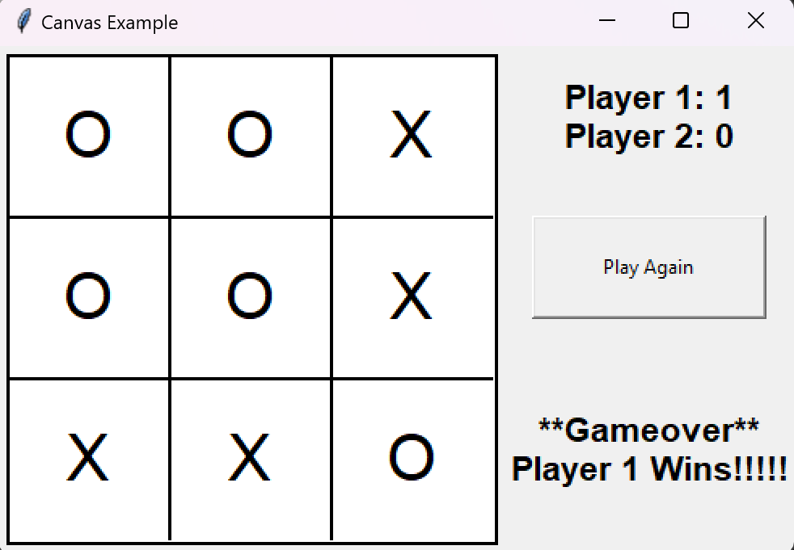

# Tkinter Tic-Tac-Toe Game



This is a simple implementation of the classic Tic-Tac-Toe game using the Tkinter library in Python. The game features a graphical user interface (GUI) where two players can take turns making moves on a 3x3 grid. The game checks for a winner or a tie after each move.

## Features

- **Player vs Player:** Two players can play against each other taking turns to mark X and O on the board.
- **Dynamic GUI:** The graphical user interface is created using Tkinter, providing an interactive experience.
- **Winning Conditions:** The game checks for winning conditions after each move, and it declares the winner or a tie accordingly.
- **Retry Option:** Players can choose to play again after a game ends.

## How to Play

1. Run the Python script (`tic_tac_toe.py`).
2. The game window will appear with a 3x3 grid.
3. Players take turns clicking on an empty cell to place their mark (X or O).
4. The game checks for a winner or a tie after each move.
5. If the game ends, a message will be displayed, and players can choose to play again.

## Requirements

- Python 3.x
- Tkinter library (usually included with Python installations)

## Usage

Run the following command in your terminal or command prompt:

```bash
python tic_tac_toe.py
